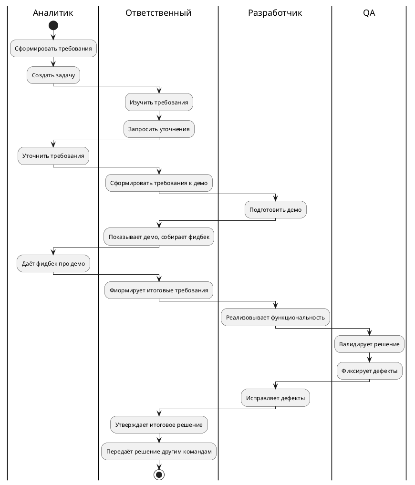
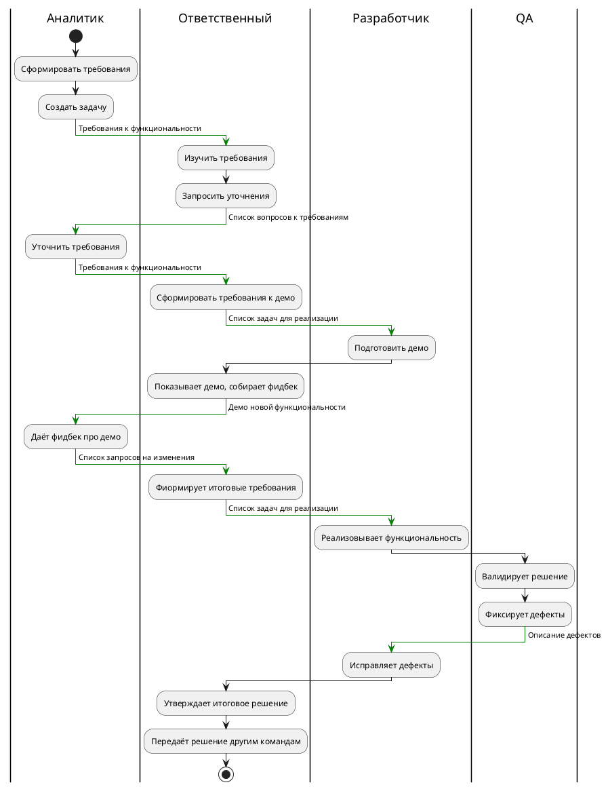

### Введение

Цель - рассказать про процессы с точки зрения управления проектами, моделирования бизнес-процессов и возможностей применения этих знаний для улучшения качества работы (в контексте разработки ПО).

Процесс - совокупность взаимосвязанных или взаимодействующих видов деятельности, преобразующих входы в выходы.

---
### Уровень 0. Что-то происходит
При многократном выполнении похожих задач формируется опыт (что нужно делать, как не нужно делать) и алгоритм (последовательность действий для достижения поставленной задачи).

Появляется человек со знаниями. Он пытается делать каждый раз опираясь на опыт прошлого, иногда делиться опытом и делегировать.

Когда другому человеку нужно начать делать аналогичные задачи, то он начинает спрашивать у "эксперта", анализирует результат работы по прошлым задачам.

---
### Уровень 0. Проблемы
В какой-то момент подход становиться недостаточно расширяемым:
- Много времени нужно, чтобы объяснить новому человеку
- Тяжело и долго проверить, что всё сделано так, как нужно

Появляется желание процесс формализовать.

---
### Уровень 1. Текстовое описание
Первым шагом по улучшения процесс является описание процесса.
Зачем:
- Описание становится документацией, упрощает передачу знаний
- Описание процесса можно сравнивать с реально происходящим процессов и находить места, где не по плану выполняется работа

---
### Пример процесса
Опишем абстрактный контекст в рамках которого будет существовать процесс.

Представим, что есть некая компания, которая занимается разработкой своего ПО. В ней сформировалась подходы к работе. В какой-то момент один из её участников решил составить описание процесса:
1. Инициируется создание нового проекта
2. Пишется код с реализацией требований
3. По мере реализации происходят уточнения требований
4. После того, как код будет готов, начинается тестирование
5. Создаются и чинятся дефекты
6. После закрытия всех дефектов проект отдаётся тех. писам.

---
### Уровень 2. Ролевая модель в процессе
Следующим значимым улучшением описания процесса является добавление ролей:
- Роли дают возможность понять, что требуется от каждого члена процесса
- Роли фиксируют ответственность за людьми

---
### Выделение ролей

- Роли могут наследоваться от общеизвестных описаний и регламентов (PMBoK)
- В сложных процессах роли очень сильно видоизменяются и лучше создавать роли под конкретные процессы
- Роль в процессе != роль в компании
- Роли нужно декомпозировать и можно комбинировать
- Описание роли упрощает понимание требований к ней

---
### Выделим роли

Вернёмся к изначальному процессу и ролям. Если упростить, то можно дать такие определения ролям:
- Аналитик. Определят требования и ограничения к функциональности.
- Ответственный за функциональность. Управляет жизненным циклом функционала от момента получения требований от аналитика, до предоставления готового результата техническим писателям, поддержке.
- Разработчик. Пишет код для реализации поставленных задач.
- QA. Проверяют, что реализация соответствует требованиям.

---
### Визуализация ролей



---
### Уровень 3. Артефакты
Каждый шаг процесса имеет свои входы и выходы. Они являются частью процесса. Формализация артефактов даёт ряд плюсов:
- Знание о том, какой output ожидается, упрощает ответ на вопрос "что нужно сделать"
- Требования к input позволяет "требовать" от исполнителя прошлого шага все необходимые данные

Среди артефактов:
- Описание требований и ограничений функциональности, который описывает аналитик
- Задачи, которые формирует разработчик при декомпозиции
- Описание дефектов
- Результаты еженедельных митингов

---
### Визуализация с артефактами


---
### Внесение изменений в процесс
Представим, что процесс уже запущен, но вдруг приходит новое требование: новая функциональность должна сразу покрываться автоматическими тестами. Реализацией автоматических тестов должен заниматься разработчик из специальной команды.

При обсуждении изменений в процессах выделяют термины "as is" и "to be": процесс до изменений и после. Их сравнение позволяет:
- Увидеть насколько больше шагов нужно делать
- Увидеть как меняется положение каждой роли и корректировать требования к квалификации
- Увидеть новые переходы между ролями и понять какие новые формы и шаблоны коммуникации нужны

---
### Процесс to be
```plantuml
|Ответственный|
:Сформировать итоговые требования;
:Запросить список сцнариев
для автотестов;
-[#green]-> Итоговые требования к функциональности;
  
|QA|
:Подготовить тест-кейсы;
-[#green]-> Список тест-кейсов;
  
|Test dev|
:Подготовить авто-тесты;
-[#green]-> Отчёт о создании авто-тестов;
  
|Разработчик|
:Реализовывает
функциональность;
```

---
### Уровень 4. Оценка процесса
Если процесс описан, то его можно оценить. Есть много систем оценивания, среди которых и ГОСТ 33020. Он определяет набор атрибутов процесс, например:

- Атрибут управления осуществлением
- Атрибут определения процесса
- Атрибут инновации процесса

---
### Атрибут управления осуществлением
- Определены цели процесса
- Осуществление процесса планируется, и проводится его мониторинг
- Осуществление процесса регулируется для соответствия планам
- Определены роли и полномочия в рамках процесса
- Определены источники информации, необходимые для осуществления процесса

Анализируемый процесс имеет цель (реализовать функциональность), он планируется и мониторится. В процессе выделены роли и определены источники информации, а значит процесс можно назвать управляемым.

---
### Атрибут определения процесса
- Определен стандартный процесс
- Определены последовательность и взаимодействие стандартного процесса с другими процессами
- Определены компетентности и роли, необходимые для осуществления процесса
- Определены инфраструктура и рабочая среда, необходимые для осуществления процесса;

---
### Атрибут инновации процесса
- Определены цели улучшения процесса
- Проанализированы причины вариаций при осуществлении процесса
- Проанализированы возможности применения инноваций и стандартных практик
- Установлена реализация стратегии для достижения целей улучшения процесса

Не все требования атрибутов должны достигаться процессом. У компании может не стоять за цель инновация определённых процессов, если их устраивает текущее положение дел.